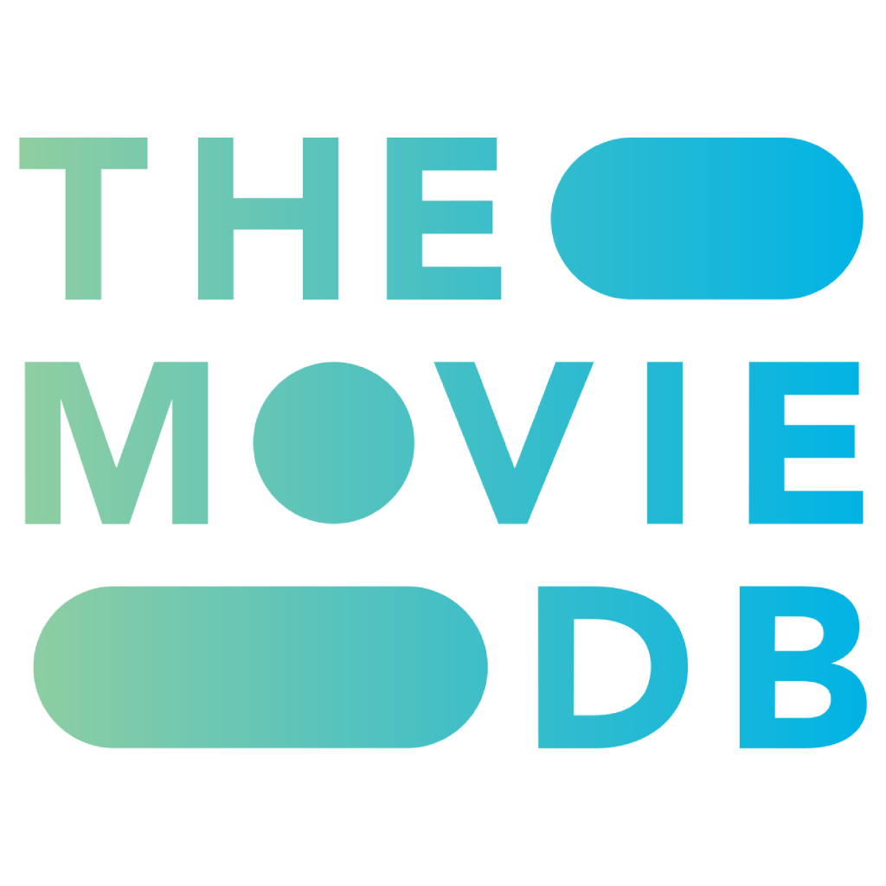
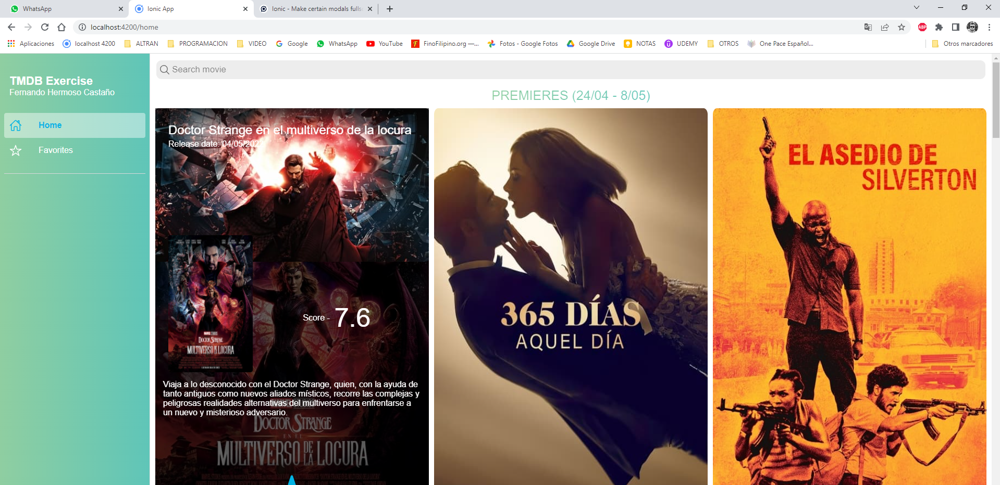
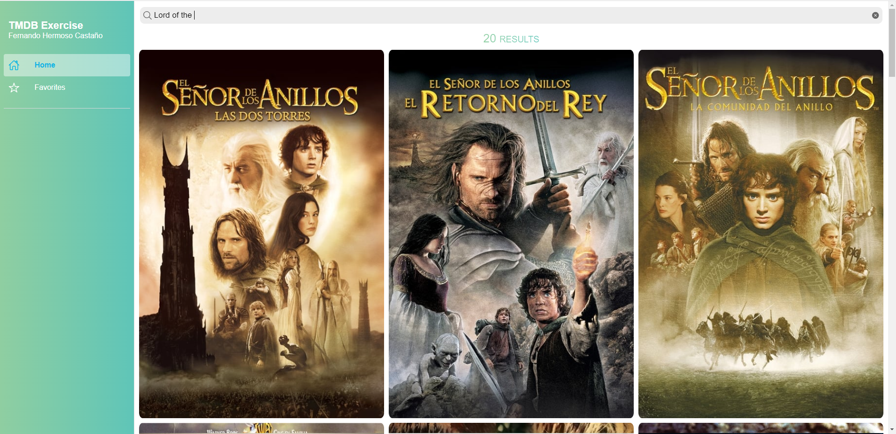
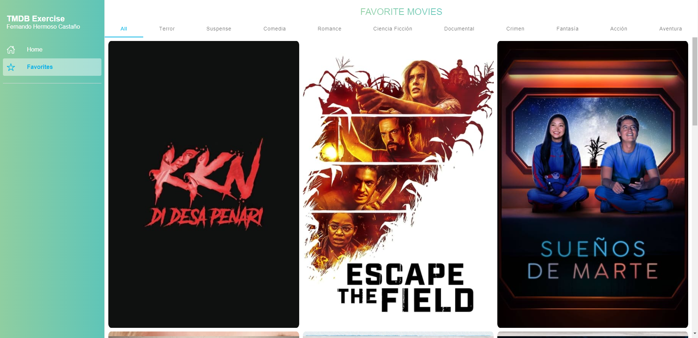
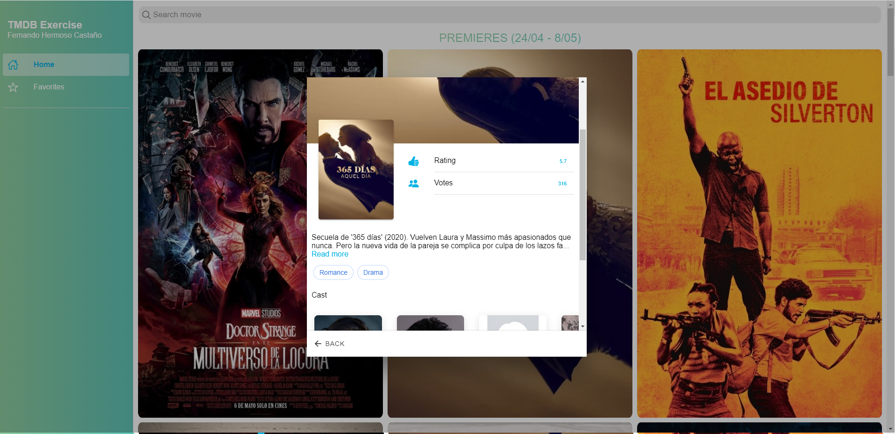
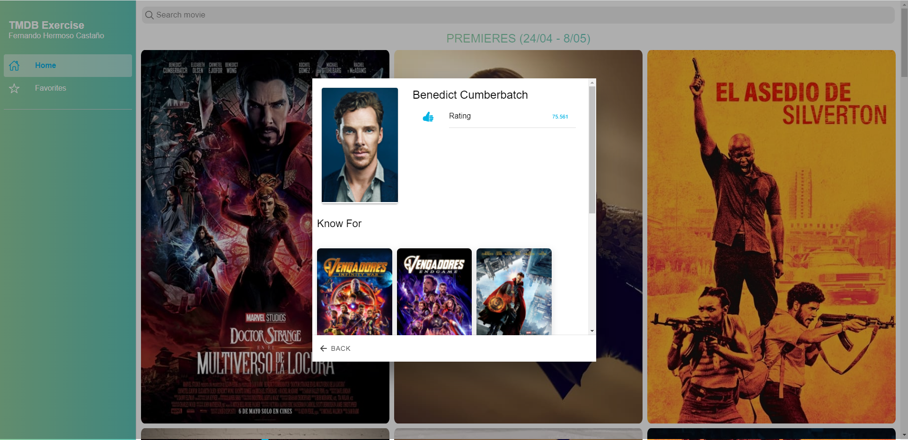

<div id="top"></div>
<br />
<div align="center">
  <a>
    
  </a>

  <h3 align="center">TMDB Exercise</h3>
   <br />
    <a href="https://stackblitz.com/github/fermoso96/TMdbExercise"><strong>LIVE DEMO</strong></a>

  <p align="center">
    Programming test that consists of creating a movie web application with the possibility of adding movies to favorites. Angular + Ionic
    <br />
  </p>
</div>


<!-- TABLE OF CONTENTS -->
<details>
  <summary>Table of Contents</summary>
  <ol>
    <li>
      <a href="#about-the-project">About The Project</a>
      <ul>
        <li><a href="#built-with">Built With</a></li>
      </ul>
    </li>
    <li>
      <a href="#getting-started">Getting Started</a>
      <ul>
        <li><a href="#prerequisites">Prerequisites</a></li>
        <li><a href="#installation">Installation</a></li>
      </ul>
    </li>
    <li><a href="#usage">Usage</a></li>
    <li><a href="#roadmap">Roadmap</a></li>
    <li><a href="#contact">Contact</a></li>
    <li><a href="#acknowledgments">Acknowledgments</a></li>
  </ol>
</details>


<!-- ABOUT THE PROJECT -->
## About The Project

The exercise will consist of making a small web application in which a list will be displayed
of movies with their poster, title and release date. In addition, each item will have an associated
“Favorites” button, which will allow you to associate/disassociate the movie from a list of favorites. 

Terms:
* The searcher + listing must be in a main path or /search.
* Add a favorites button + a list with the movies selected as favorites in /favs.

Optional terms applied:
* A detail page showing detailed information about the movie selected.

Additional features:
* Una página de detalles que muestra información detallada sobre el actor seleccionado.
* Alerts when a movie is added or removed from favorites.

<p align="right">(<a href="#top">back to top</a>)</p>


### Built With

This application has been developed on Angular V.13.0.1 and implementing Ionic 6. The node version used during development is v17.4.0

* [Angular](https://angular.io/)
* [Ionic](https://ionicframework.com/)
* [Node](https://nodejs.org/es/)

<p align="right">(<a href="#top">back to top</a>)</p>


<!-- GETTING STARTED -->
## Getting Started

### Prerequisites

Install Node.(Preferably version 17.4.0, you can use "Node Version Manager").

* [Node](https://nodejs.org/es/)
* [Node Version Manger](https://content.breatheco.de/es/how-to/nvm-install-windows)

Install Angular.

* [Angular](https://angular.io/)

* npm
  ```sh
  npm install -g @angular/cli
  ```

### Installation

1. Get a free TMDB API Key at [https://www.themoviedb.org/?language=es](https://www.themoviedb.org/?language=es)
 
2. Clone the repo
 
   ```sh
   git clone https://github.com/fermoso96/TMdbExercise.git
   ```
3. Install NPM packages
 
   ```sh
   npm install
   ```
4. Enter your API in `src\environments\environment.ts` and `src\environments\environment.prod.ts`
 
   ```js
   api_key = 'ENTER YOUR API';
   ```
5. Start the application
 
   ```sh
    npm start
   ```

<p align="right">(<a href="#top">back to top</a>)</p>


<!-- USAGE EXAMPLES -->
## Usage

The application is divided into two main pages, "Home" and "Favorites". You can navigate between them through the side menu.
In mobile formats you can open the menu by sliding your finger across the screen from the left side.

1. Home Page:

    

    The "Home" page shows the premieres of the last me. Hovering over a movie shows its detail. At the bottom of the detail of a movie we find a button that allows us to add it to favorites.

    At the top we find the search bar. At the end of writing what we want to search for, the premieres will be replaced by the search result. If the search bar is empty, the premieres will reappear.
    
    

2. Favorites Page:

    

    If we navigate through the side menu to the "Favorites" page we will find all the movies that we have marked as favorites and some "tabs" to be able to filter them by genre.

3. Favorites Page:

    

    In this window we will see the actors who participate in the movie. If we click on an actor another window will open with the details of this actor, here we can see the movies in which he has participated and if we click on one we can see its details.

    


<p align="right">(<a href="#top">back to top</a>)</p>


<!-- ROADMAP -->
## Roadmap

- [x] Add Side Menu.
- [x] Add Home Page.
- [x] Add Search Feature.
- [x] Add Favorites Feature.
- [x] Add Detail View.
- [x] Add Cast Detail View.
- [x] Add Alerts Feature.
- [ ] Add Favorites Feature to mobile devices.
- [ ] Add a button to open the side menu in mobile formats.
- [ ] Generate Documentation.

_When we're on portable devices, we can't 'hover' to see the favorites button on a movie-card. To implement this functionality we should show a favorites button in the detail modal only when we are on mobile devices. When closing the modal, an event should be fired that updates the information on the favorites page._

<p align="right">(<a href="#top">back to top</a>)</p>

<!-- CONTACT -->
## Contact

Fernando Hermoso Castaño - tlf:678297372 - ferhc96@gmail.com

Project Link: [https://github.com/fermoso96/TMdbExercise](https://github.com/fermoso96/TMdbExercise)

<p align="right">(<a href="#top">back to top</a>)</p>


<!-- ACKNOWLEDGMENTS -->
## Acknowledgments

* [Node Version Manger](https://content.breatheco.de/es/how-to/nvm-install-windows)
* [Ionic Storage](https://ionicframework.com/docs/angular/storage)
* [Quick Type](https://app.quicktype.io/)

<p align="right">(<a href="#top">back to top</a>)</p>


<!-- MARKDOWN LINKS & IMAGES -->
[linkedin-shield]: https://img.shields.io/badge/-LinkedIn-black.svg?style=for-the-badge&logo=linkedin&colorB=555
[linkedin-url]: https://https://www.linkedin.com/in/fernando-hermoso-casta%C3%B1o-36784a194/